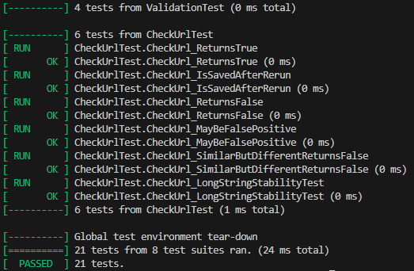
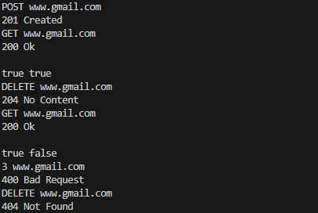

# Gmail-Project

## Gmail Project Part 2 - Server & Client


## 🧿 Project Overview

This project implements a simple server that manages blacklisted URLs using a Bloom Filter and a persistent blacklist file.

The server supports a set of textual commands sent by clients over a socket connection. The commands allow clients to manage the blacklist, check URLs, and retrieve server status.

This Bloom Filter implementation, along with the communication between the server and the client, represents the second component of a Gmail project. 
It will eventually be integrated into Gmail for email handling and spam filtering.


## 💡 Commands Supported

- `POST [URL]` | Adds a URL to the Bloom Filter and to the blacklist file. 
- `DELETE [URL]` | Removes a URL from the blacklist file (Bloom Filter is **not** changed).
- `GET [URL]` | Checks if the URL is in the blacklist.

## 🧩 Project Structure

- `BloomFilter.cpp` — Implementation and declaration of the Bloom Filter logic.  
- `tests/` — Directory containing unit and integration tests.  
- Additional `.cpp` and `.h` files — Contain supporting logic and modular components used across the project.

## 📈 Changes from Part 1

One of the major improvements in this part of the project was **renaming and reorganizing the command structure**.

### 🔍 What Changed

- We renamed the commands (e.g., `1` → `POST`) to make them more semantic and readable.
- We renamed the commands (e.g., `2` → `GET`) to make them more semantic and readable.
- We also introduced a new command, `DELETE`
Despite these changes, **the core logic required minimal adjustments** thanks to the design of our code.

### 🎯 Why It Was Easy

- The project follows the **SOLID principles**, particularly:
  - **Single Responsibility**: Each component handles a clear, well-defined task.
  - **Open/Closed**: The command system is open for extension (new commands), but closed for modification.
- The command handling and menu system were built using a **design pattern** that allows for **easy mapping between menu options and command names**.

As a result, updating the names of commands in the menu required only a small change in one configuration-like location, without rewriting the entire control flow or affecting business logic.


## 🚀 How to Run

### Compile the server
```bash
docker-compose up --build -d
```

### Run the server
```bash
docker exec -dit "server" "./server" "<port>" "<size_of_bloom_filter>" "<hash_amount_2>"
```

### Run the client
If provided port is 5555
do: 
```bash
docker attach client
```
If port is other then 5555 do:
```bash
docker exec -it "client" "python" "./client.py" "server" "<port>" 
```

### Build the tests
```bash
docker build -f ./DockerfileTests -t bloomfilter-tests .
```

### Run the tests
```bash
docker run -it --rm bloomfilter-tests
```

### ✅ Test Results

The following screenshot shows a successful run of all unit tests:



### ▶️ Usage Example


