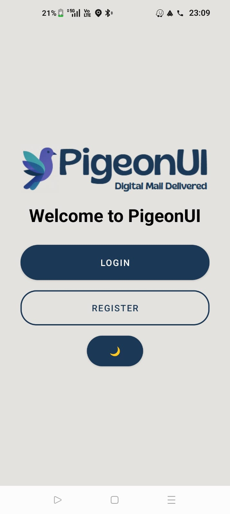
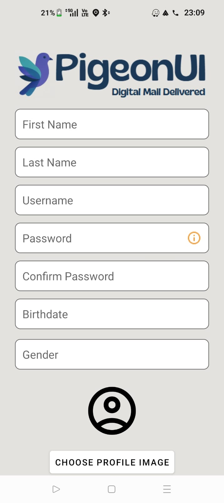
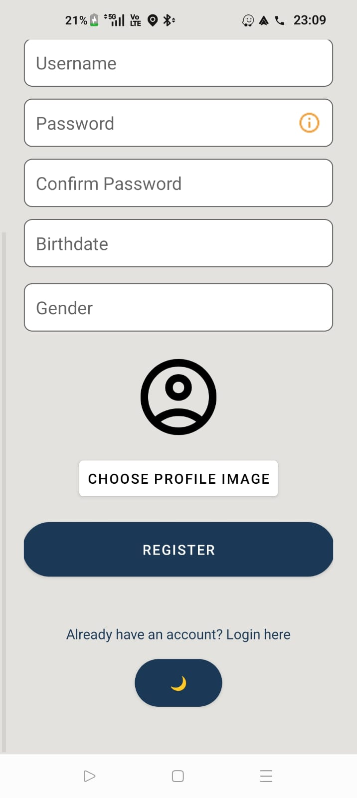
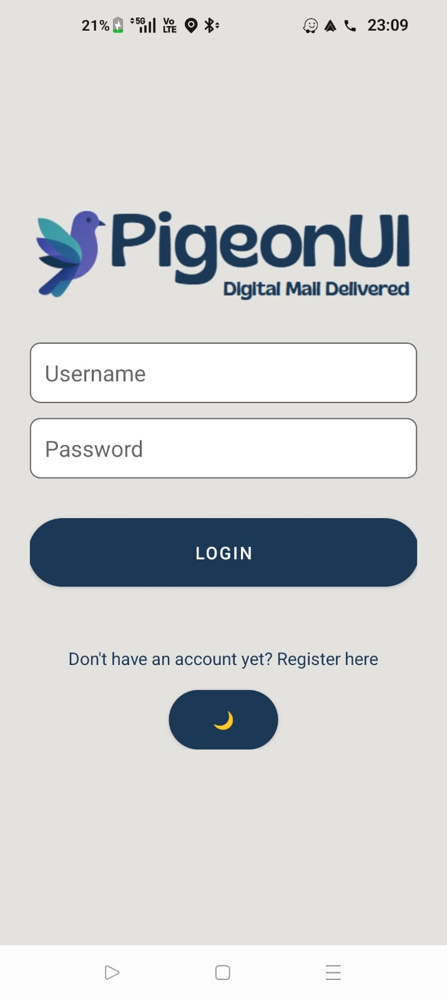
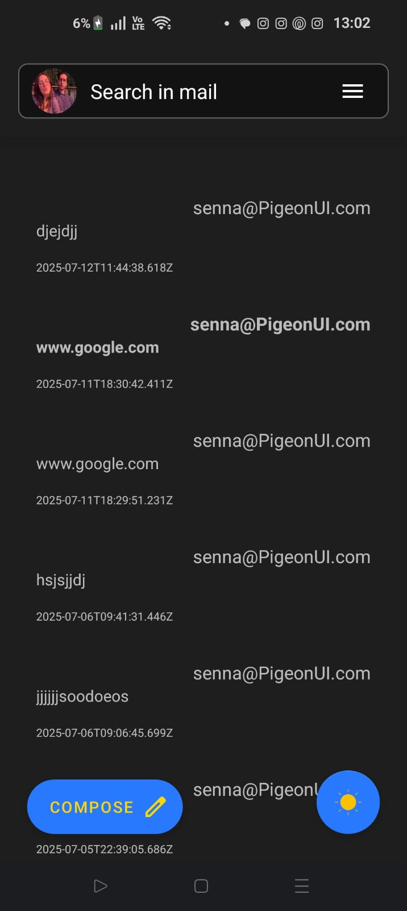
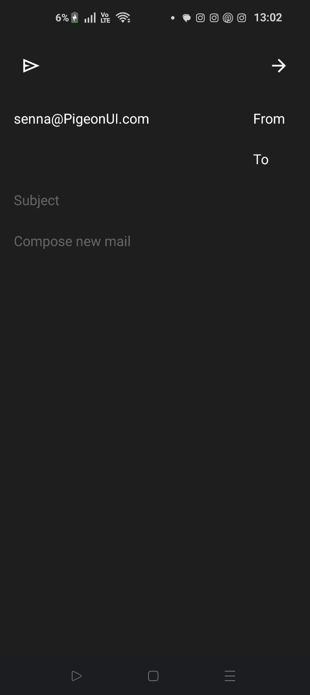
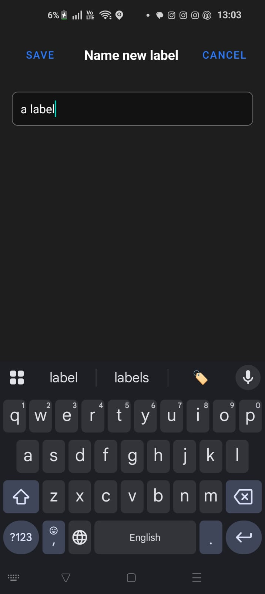
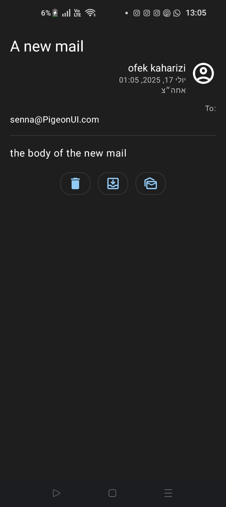
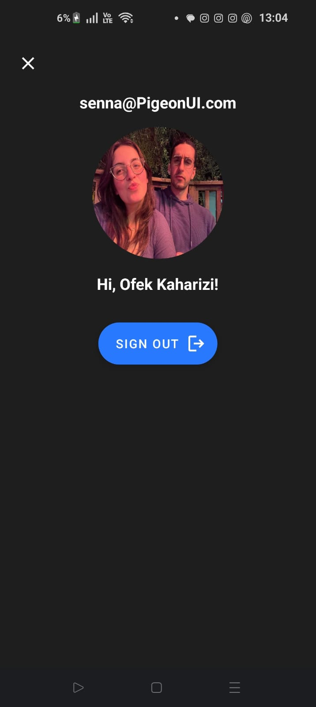
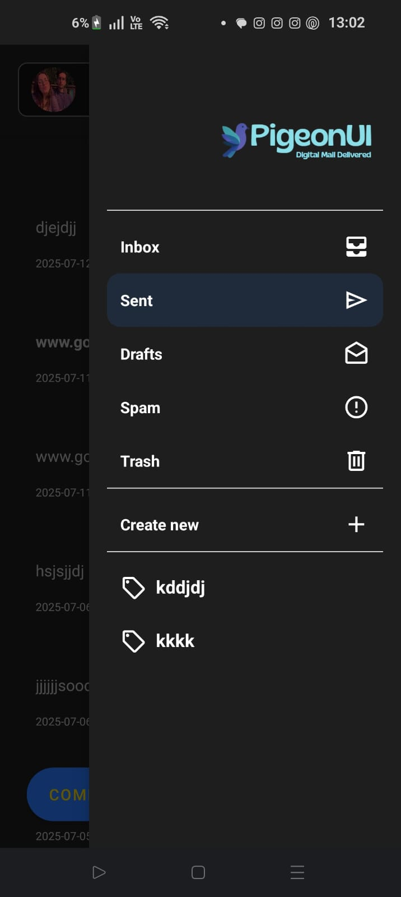

# 🤖 Android App - PigeonUI

---

## 📨 Overview

The Android app of **PigeonUI** is developed in **Java** using **Android Studio**.  
It provides a mobile-first email experience, similar to Gmail, including inbox management, labels, sending/receiving emails, and theme support (dark/light).

The app follows the **MVVM (Model-View-ViewModel)** architecture and uses modern Android tools such as **LiveData**, **ViewModel**, **Room**, and **Retrofit**.

---

## 🧰 Tech Stack

- **Java** – Primary programming language  
- **Retrofit** – HTTP client for interacting with backend API  
- **Room Database** – For local data caching and offline access  
- **LiveData & ViewModel** – Reactive UI updates with lifecycle awareness  
- **Material Design 3** – UI components and styling  

---

## 🗂️ Project Structure

PigeonUI-Android/
├── app/ # Main Android application module (source code + resources)
├── gradle/ # Gradle wrapper files (version configuration)
├── .gitignore # Git ignore rules for local files and build artifacts
├── build.gradle.kts # Project-level Gradle build file (Kotlin DSL)
├── gradle.properties # Configuration properties for Gradle
├── gradlew # Gradle wrapper script (Unix/Linux)
├── gradlew.bat # Gradle wrapper script (Windows)
└── settings.gradle.kts # Declares included modules (e.g., app)

## Login and Registration
 

 

 

 


## Inbox
 

## Compose mail
 

## Create label
- In the Android app, editing and deleting a label will be done via long press.
 

## Mail details
 

## Profile
 

## Menu
 

### run with android device
navigate to raw
at the file named server_config.json change to your own IP

```
{
    "base_url": "http://yourOwnIP:8080/"
}
```
### run with emulator
navigate to raw
at the file named server_config.json change to the default - 
```
{
    "base_url": "http://10.0.2.2:8080/"
}
```