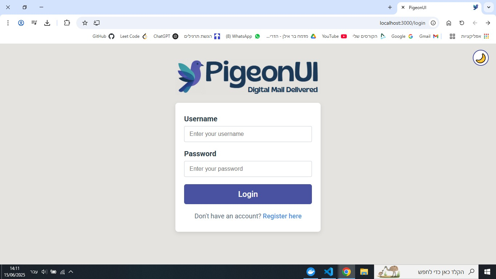
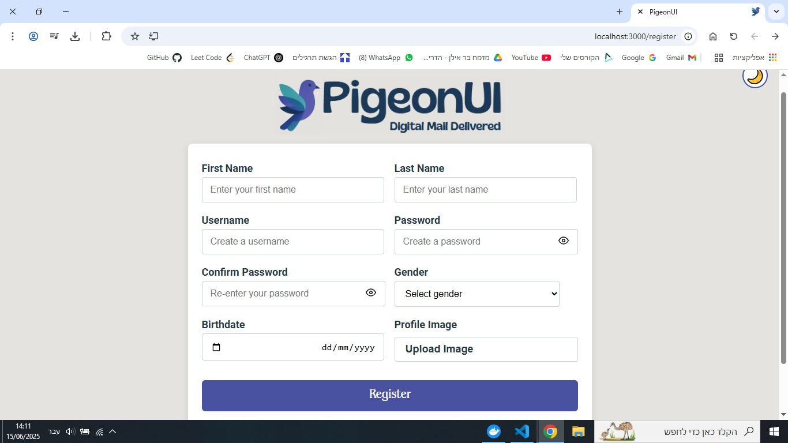
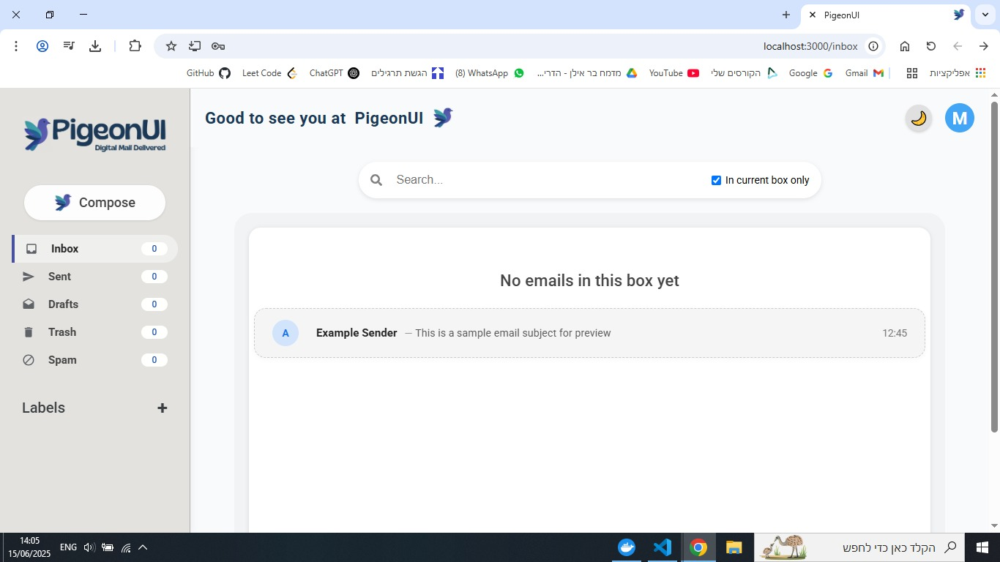
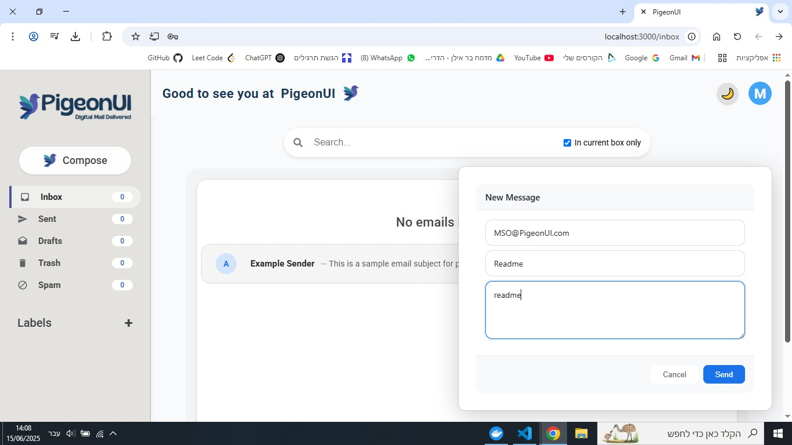
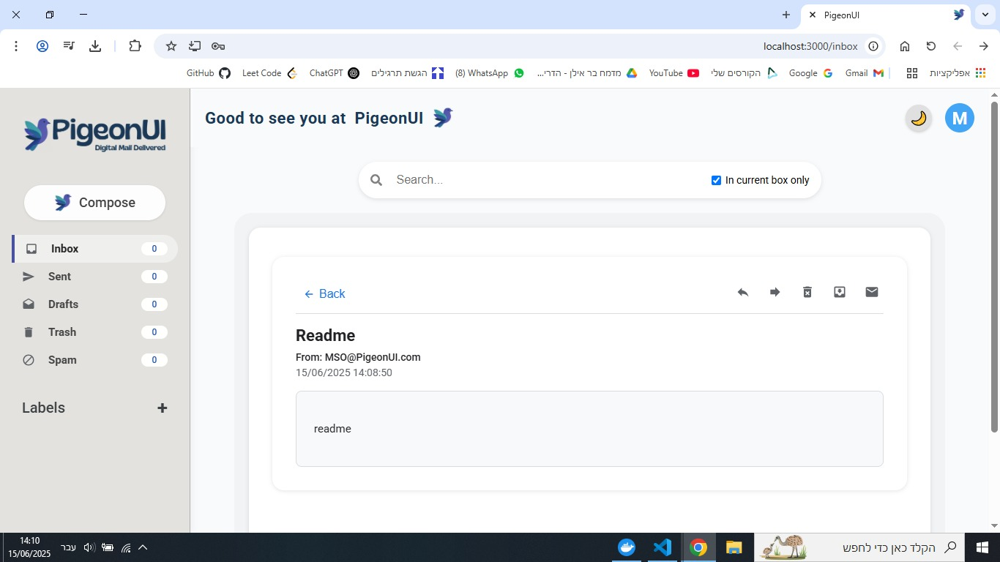
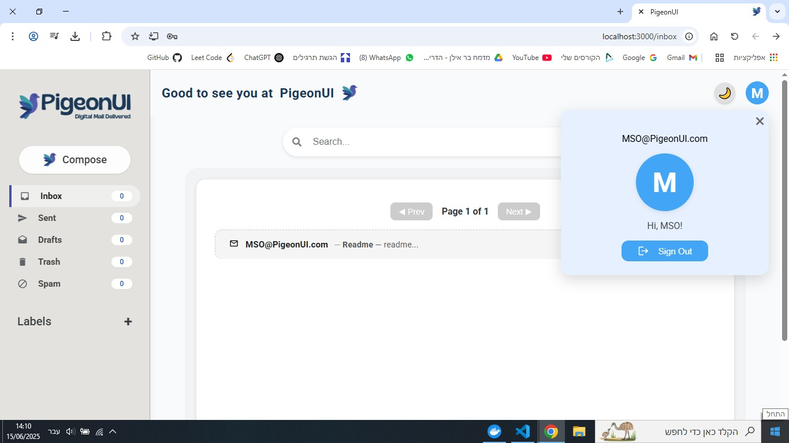
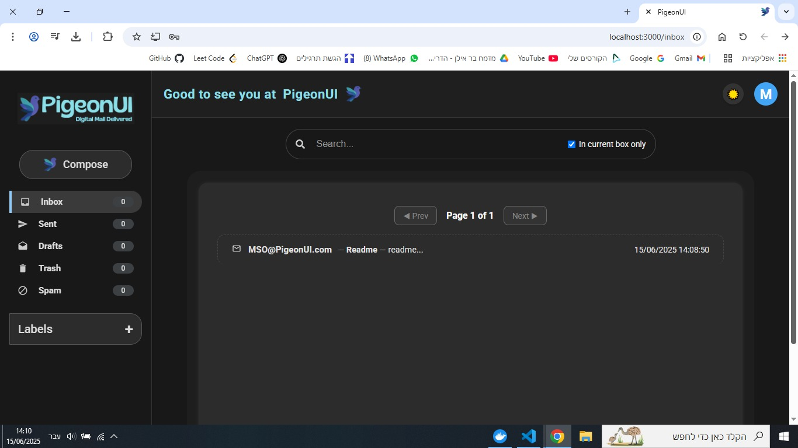

# 🌐 Frontend Web – PigeonUI

This document describes the **React.js-based web interface** of the PigeonUI project.  
It provides a responsive and intuitive UI for managing emails, labels, user authentication, and interface styling (including dark mode support).

---

## 🧰 Tech Stack

- **React.js** – Component-based JavaScript library for building the UI  
- **React Router** – Client-side routing for navigation between views  
- **Axios** – HTTP client for interacting with the backend API  
- **Context API** – Global state management  
- **useAuth** – Custom hook for authentication logic  
- **ThemeContext** – Handles dark/light mode toggling

---

## 🗂️ Project Structure

PigeonUI-React/
    ├── public/ # Static assets (index.html, icons, logos)
    ├── src/ # Source code for components, pages, and contexts
    ├── .gitignore # Git ignore rules
    ├── default.conf # NGINX configuration (used for Docker deployment)
    ├── Dockerfile # Instructions to build the React app in a container
    ├── package.json # Project metadata, scripts, and dependencies
    ├── package-lock.json # Exact dependency versions (auto-generated)
    └── README.md # Project overview and usage instructions

## 🧭 Routing Structure

The app uses **React Router v6** for client-side navigation.  
Below is the list of defined routes and their purpose:

| Route        | Component        | Access           | Description                             |
|--------------|------------------|------------------|-----------------------------------------|
| `/`          | `Login`          | Public           | Default route – redirects to login page |
| `/login`     | `Login`          | Public           | User login form                         |
| `/register`  | `Register`       | Public           | New user registration page              |
| `/inbox`     | `InboxPage`      | **Private**      | User's inbox – only accessible when logged in |

---

### 🔒 PrivateRoute

The route to `/inbox` is protected using a custom wrapper component called `PrivateRoute`.  
This ensures only authenticated users can access the inbox.

### Related Components
- src/Pages/Login.js – Login page

- src/Pages/Register.js – Registration form

- src/Pages/InboxPage.js – Main inbox view

- src/components/PrivateRoute.js – Auth wrapper for protected routes

## 📸 Screenshots & Demo

- ### Login page

- ### Signup page

- ### Inbox view

- ### Compose message

- ### Inbox view after sending an email

- ### Email view

- ### Logout

- ### Dark/light mode switch

## Next Steps
- **[Android App Docs](AndroidApp.md)** – Mobile app details